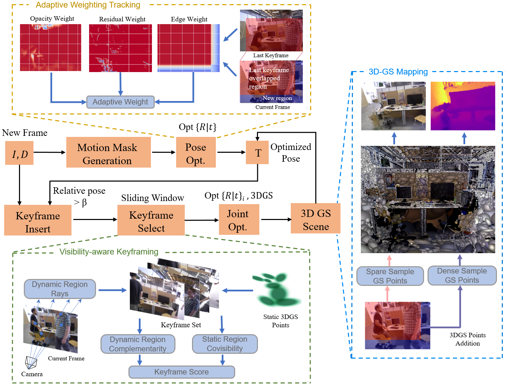

# RGD-SLAM

Overview of RGD-SLAM: our system is designed to estimate camera pose in dynamic environments and reconstruct static scenes from sequences of RGB-D frames. It consists of two main components: a front-end tracking and a back-end mapping. The frontend generates a motion mask for each frame and uses the adaptive weight tracking to optimize the camera pose. The backend uses a visibility-aware keyframing strategy and maintains a sliding window, optimizing the static 3DGS scene representation comprehensively.
## Coming Soon ##