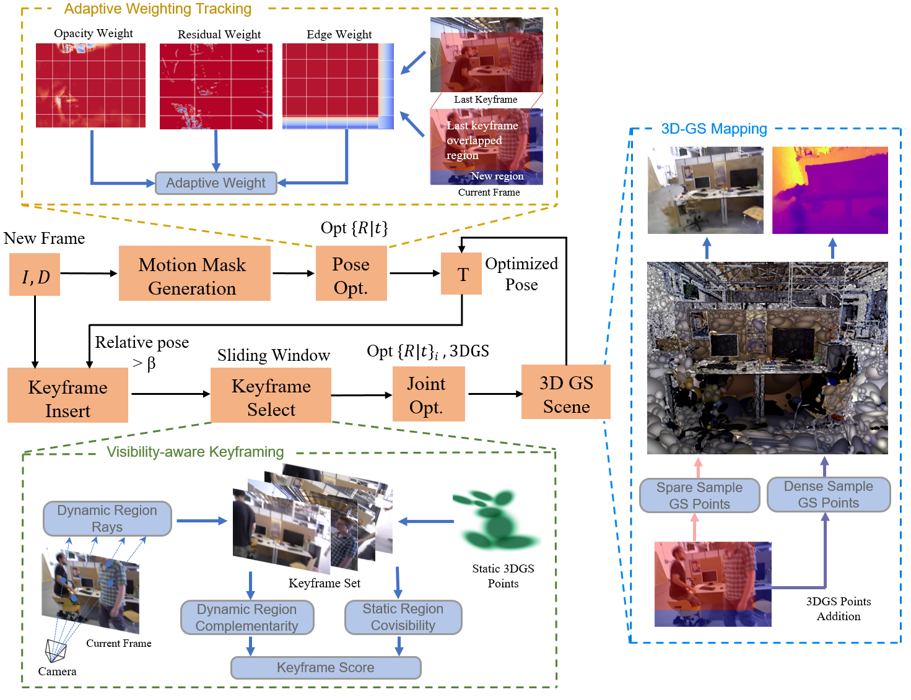

# RGD-SLAM: Robust Gaussian Splatting SLAM for Dynamic Environments

Overview of RGD-SLAM: our system is designed to estimate camera pose in dynamic environments and reconstruct static scenes from sequences of RGB-D frames. It consists of two main components: a front-end tracking and a back-end mapping. The frontend generates a motion mask for each frame and uses the adaptive weight to optimize the camera pose. The backend uses a visibility-aware keyframing strategy and maintains a sliding window, optimizing the static 3DGS scene representation comprehensively.
## Installation ##
You can create an anaconda environment called ismap. Please install libopenexr-dev before creating the environment.
``` 
conda env create -f environment.yaml
``` 
We recommend following the [MonoGS](https://github.com/muskie82/MonoGS) method for SLAM environment configuration． 

Then you will then need to install OneFormer to use the segmentation network. We recommend installing it from [here.](https://github.com/SHI-Labs/OneFormer)
## Download Dataset & Data preprocessing ##
You can download the data as below.
``` 
bash scripts/download_replica.sh
``` 
## Run ##
After downloading the dataset, you can run RGD-SLAM:
``` 
python slam.py --config configs/rgbd/tum/fr3_walking_halfsphere.yaml
``` 
The system defaults to performing single-threaded tracking and mapping. Dual-threaded tracking and mapping is not currently supported and is planned to be implemented in the next version.
## Evaluation ##
To evaluate the average trajectory error. Run the command below with the corresponding config file:
``` 
python slam.py --config configs/rgbd/tum/fr3_walking_halfsphere.yaml --eval
``` 
This flag will automatically run system, and log the results including the rendering metrics.
## Acknowledgement ##
Thanks to previous open-sourced repo: [MonoGS](https://github.com/muskie82/MonoGS), [DG-SLAM](https://github.com/fudan-zvg/DG-SLAM), [OneFormer](https://github.com/SHI-Labs/OneFormer), [dotmask](https://github.com/introlab/dotmask)
## Citing ##
If you find our work useful, please consider citing:
``` 
@article{WANG2026113071,
title = {RGD-SLAM: Robust Gaussian splatting SLAM for dynamic environments},
journal = {Pattern Recognition},
volume = {175},
pages = {113071},
year = {2026},
issn = {0031-3203}
}
``` 
